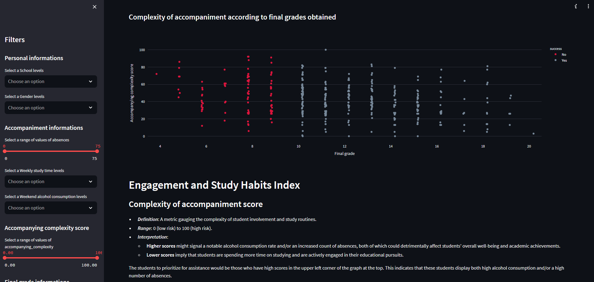

# Source:
Paulo Cortez, University of Minho, Guimares, Portugal, http://www3.dsi.uminho.pt/pcortez

# Data Set Information:
This data approaches student achievement in secondary education of two Portuguese schools. The data attributes include student grades, demographic, social and school related features, and it was collected by using school reports and questionnaires.

# Run application
## Run on local
```
streamlit run app/daschboard.py
```

## Build a Docker image
```
docker build -t streamlit .
```

## Run on docker container
```
docker run -p 8501:8501 streamlit
```




# Project
## Engagement and Study Habits Index
### Complexity of accompaniment score
- ***Definition***: A metric gauging the complexity of student involvement and study routines.
- ***Range***: 0 (low risk) to 100 (high risk).
- ***Interpretation***:
    * **Higher scores** might signal a notable alcohol consumption rate and/or an increased count of absences, both of which could detrimentally affect students' overall well-being and academic achievements.
    * **Lower scores** imply that students are spending more time on studying and are actively engaged in their educational pursuits.

The students to prioritize for assistance would be those who have high scores in the upper left
corner of the graph at the top. This indicates that these students display both
high alcohol consumption and/or a high number of absences.
